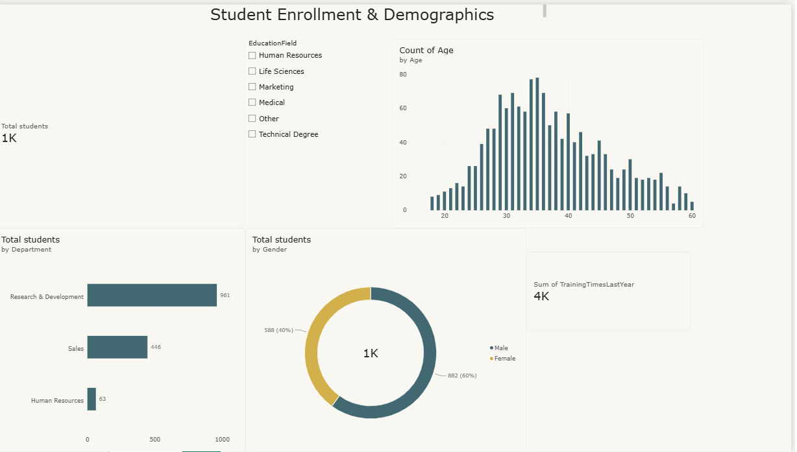

# Power BI Projects - CodeAlpha Internship

This repository contains my work during Data Analytics Internship at CodeAlpha.

## Project 1: HR Analytics - Employee Attrition Dashboard
- File: CodeAlpha_HR Analytics_Final.pdf
- Key Insight: Attrition Rate is 16.12%
- Analysis by: Department, Gender, Education Field, Business Travel, OverTime
- Tools: Power BI, Power Query, DAX

## Project 2: PU Student Analytics Dashboard
- File: CodeAlpha_PU_Student_Analytics_Dashboard
- Screenshot: Codealpha-PUStudent_Analytics-Dshboard.png
- Key Insight: Total 1K Students, analyzed by Age, Education, Course
- Tools: Power BI

### Dashboard Preview

### How to View
- PDF files can be viewed directly on GitHub
- .pbix file: Download and open in Power BI Desktop

---
**By:** Noorain Zehra | **Internship:** CodeAlpha
